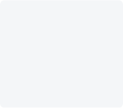
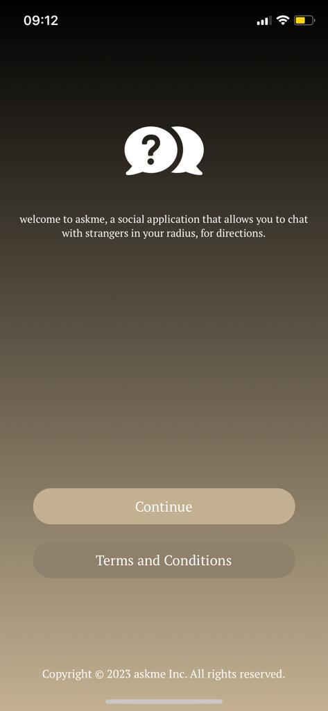
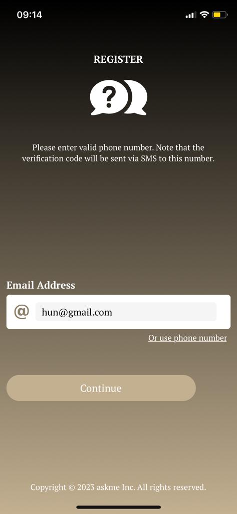
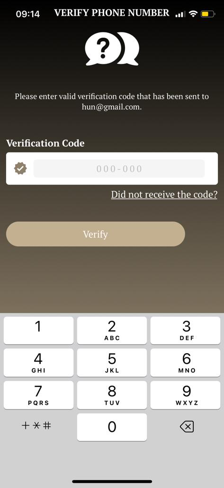
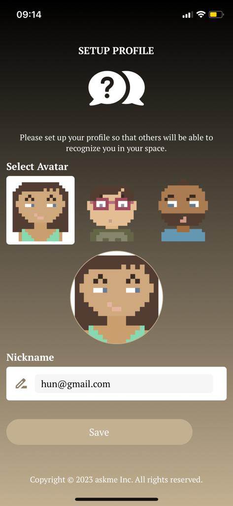
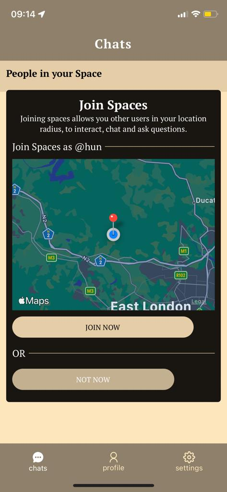
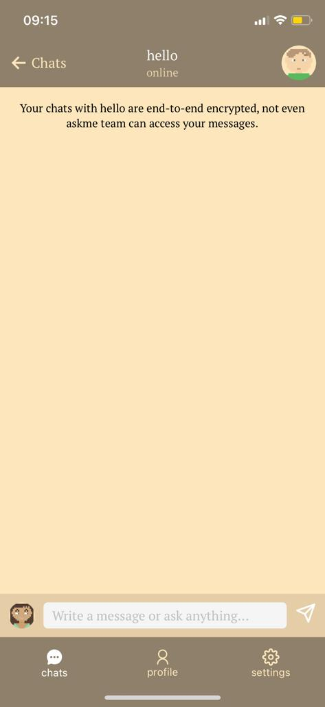
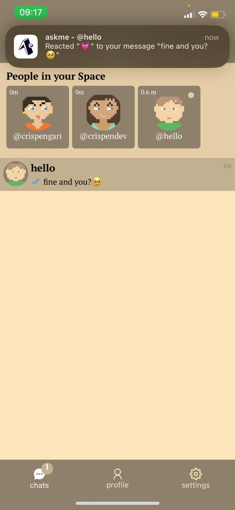
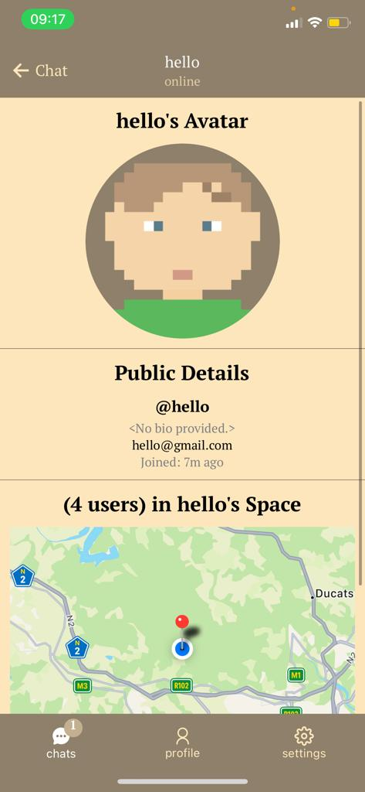
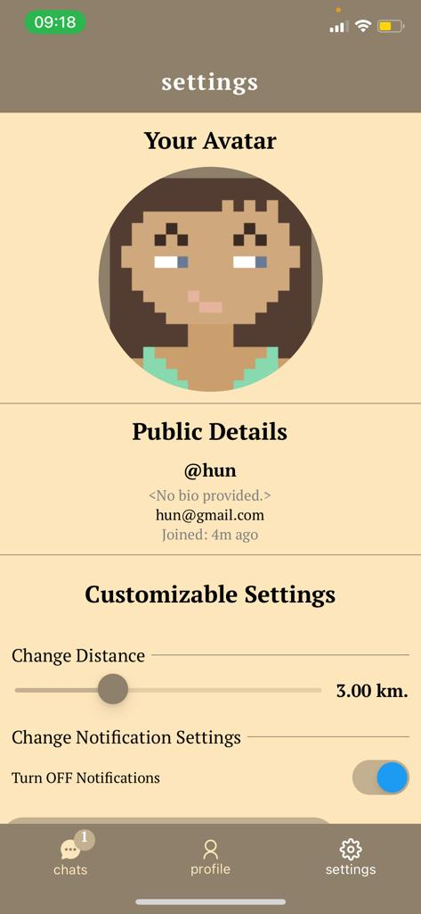

### askme

This is a mobile application designed to connect people on the same complex to ask, interact and communicate with each other in the same location radius a.k.a as `spaces`. People in the same `space` can be able to:

1. `2-way` communicate using messages
2. see each other location.

<p align="center">
    
</p>

### What is used in this startup?

1. `prisma` orm
2. `fastify`- for server
3. `web sockets` (with fastify)
4. `postgres` - for `database`
5. `redis` - for `cache`
6. `react-native` - client
7. `docker`
8. `ngrok`

### App flow

`askme` is a react native application that is using `monorepo` approach with `yarn-workspaces`. This monorepo application contains the following packages:

1. `mobile` - a react-native application initialised using `expo` consuming the `trpc` api.
2. `server` - a `trpc` with `fastify` server that serves data from `prisma`-`postgres` database.
3. `common` - contains shared code between `mobile` and `server`

Here is the chat-flow of the application.

```
                              [GET USER LOCATION] ------> [LOCAL USERS]
                                        |
                                        |----------------> [TRACK LOCATION]
                                        |
[USER] ---> [AUTHENTICATION] ----> [USING_APP] ---------> [SEND AND RECEIVE MSGS]
                  |                     |______
                  |                            |---------> [GET NOTIFICATIONS]
                  |
            [NEW DEVICE AUTH] ----> [LOGOUT ALL OTHER DEVICES] ------> [USAGE]
                                    (login the current device)

```

### Auth Screens

When the user is not authenticated, they will be able to go through the authentication flow with either `email` or `phone-number`. A One Time Password (`OTP`) with 6 digits will be sent via `email` or `sms` depending on which provider did you use for authentication between:

- phone-number
- email-address

When provider verification completes you will be navigated to the `profile` screen where you will be able to set your `nickname` together with random `avatar`s.

Here are the screenshot of the authentication flow chat:

<p align="center">
    
    
    
    
</p>

> Note that only one device is allowed to use the app at a time, when new authentication on a new device is detected then you will be forced to logout, when the verification completes.

### App Screens

An authenticated user can be able to see the following app screens and use the app.

<p align="center">
    
    
    
    
    
</p>

In the app you can:

- `change settings`
  - notifications
  - space radius (distance)
- `update profile`
  - update avatar
  - update nickname
- `leave and join spaces`
- `chat`
  - start new chats
  - continue chatting
  - react to messages
- `see people in your space`
- `get notifications`
  - when new user in your space join
  - when the user went online
  - when the user sent a message
  - when the user like message
  - when the user went offline

### Getting started.

You can be able to test this application locally, you just have to makesure that you have the following softwares installed on your computer:

1. [x] `NodeJS`.
2. [x] `Ngrok`.
3. [x] `Docker`.

Navigate to `docker` folder by running the following command:

```shell
cd docker
```

Then run the following command

```shell
docker compose up -d
```

This will start a `postgres` together with the `redis` container.

Next you will need to navigate to the `prisma` folder by running the following command

```shell
cd prisma
```

After that you will need to run migrations by running the following command:

```shell
npx prisma migrate dev --name init
```

When everything works you will need to forward the request that are coming at port `3001` to the server using `ngrok` so open the `ngrok` client on your computer by running the following command

```shell
ngrok http 3001
```

Copy the forwarding `url` and modify the `packages/common/src/index.ts` as mentioned in the `/docker/README.md` file. Also if you don't have `ngrok` installed locally you can get the instruction on how we can forward requests that are coming at port `3001` using `docker`.

Now you can start the server by navigating to the `packages/server` by running the following command

```shell
cd packages/server
```

And to start the server you need to run the following command:

```shell
yarn start
```

Open another terminal and navigate to `packages/mobile` to start a `react-native` app

```shell
cd packages/mobile
```

Then run:

```shell
yarn start
```

Then you can scan a `QR` code on your mobile app and start using the app locally.

Alternatively you can start both the `server` and the `mobile` by running the following command:

```shell
yarn start
```

> You just have to make sure that you are in the `askme` folder.

### License

`askme` is using `MIT` license which reads as follows:

```shell
MIT License

Copyright (c) 2023 crispengari

Permission is hereby granted, free of charge, to any person obtaining a copy
of this software and associated documentation files (the "Software"), to deal
in the Software without restriction, including without limitation the rights
to use, copy, modify, merge, publish, distribute, sublicense, and/or sell
copies of the Software, and to permit persons to whom the Software is
furnished to do so, subject to the following conditions:

The above copyright notice and this permission notice shall be included in all
copies or substantial portions of the Software.

THE SOFTWARE IS PROVIDED "AS IS", WITHOUT WARRANTY OF ANY KIND, EXPRESS OR
IMPLIED, INCLUDING BUT NOT LIMITED TO THE WARRANTIES OF MERCHANTABILITY,
FITNESS FOR A PARTICULAR PURPOSE AND NONINFRINGEMENT. IN NO EVENT SHALL THE
AUTHORS OR COPYRIGHT HOLDERS BE LIABLE FOR ANY CLAIM, DAMAGES OR OTHER
LIABILITY, WHETHER IN AN ACTION OF CONTRACT, TORT OR OTHERWISE, ARISING FROM,
OUT OF OR IN CONNECTION WITH THE SOFTWARE OR THE USE OR OTHER DEALINGS IN THE
SOFTWARE.
```
