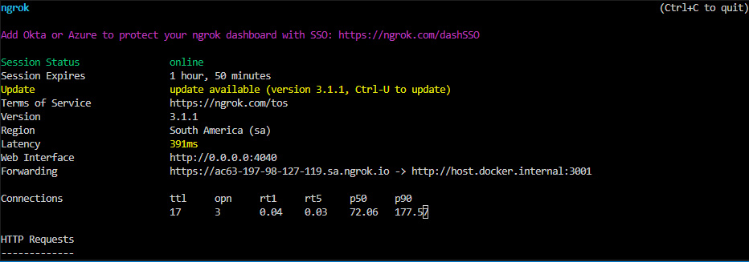

### docker

In this `README` I will give the instructions on how we can start the `redis` and `postgres` instance that will connect to our `fastify` server locally.

### Getting started

First you need to make sure that there is nothing that is running on port `5432` which is the default port of `postgres`. So to check that on `Windows` you run the following command.

```shell
netstat -ano | findstr :5432
```

```shell
TCP    127.0.0.1:4512         0.0.0.0:0              LISTENING       6096
TCP    [::1]:4512             [::]:0                 LISTENING       6096
```

If there's something that is running on this port you need to terminate it by running the following command

```shell
taskkill /PID <PID> /F
# Example
taskkill /PID 6096 /F
```

You do the same to the `redis` but the default redis port will be `6379` so you will check by running the following command.

```shell
netstat -ano | findstr :6379
```

### Starting Containers

Now we can start the instance of `redis` and `postgres` by running the following command:

```shell
docker compose up -d
```

> This command will simultaneously start an instance of `redis` and `docker` because of the `docker-compose.yml` file that I've created. If you run the `ps` command you will be able to see the following `output`:

```shell
CONTAINER ID   IMAGE                  COMMAND                  CREATED              STATUS              PORTS
       NAMES
9ec53fce56bd   postgres:14.4-alpine   "docker-entrypoint.s…"   About a minute ago   Up About a minute   0.0.0.0:5432->5432/tcp, 54321/tcp   postgres
db5942c4cd18   redis:6.2.7-alpine     "docker-entrypoint.s…"   About a minute ago   Up About a minute   0.0.0.0:6379->6379/tcp
       rediscontainer
```

If you want to stop the running container you will need to run the following command:

```shell
docker compose down
```

### Ngrok

If you don't have an [`ngrok`](https://ngrok.com/) client on your computer installed you can use the docker `image` to start an [ngrok-container](https://hub.docker.com/r/ngrok/ngrok) server that will allow us to forward requests over `http` on the `port` of the server.

```
docker run -it ngrok/ngrok:alpine http host.docker.internal:3001
```

You will get the following as output:

<p align="center">

</p>

You will need to `copy` the forwarding `url` `https://ac63-197-98-127-119.sa.ngrok.io` and take the domain and paste it in the `packages/common/src/index.ts` as `domain` as follows:

```ts
export const domain: string = "ac63-197-98-127-119.sa.ngrok.io";
```

If you have `ngrok` client you can just open it and run the following command:

```shell
ngrok http 3001
```

Take the forwarding `url` and change the `packages/common/src/index.ts` accordingly.
